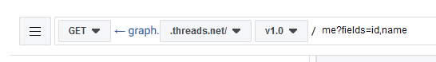
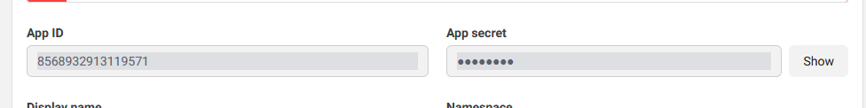

# CrossCenter

> [!WARNING]
> No guarantee of account security after use (Twitter) 
> Under development; unstable or catastrophic accidents may occur

## Tutorials

### Initial Setup

1. Rename `set.yaml.example` to `set.yaml`
2. change PostText  Example: `"{text} #sometag author: {author} url:{url} Date:{date}"` keywords: author, text, url, date

### Threads Setup

1. Open https://developers.facebook.com
2. Create an app for Threads
3. Go to App roles -> Roles
   
4. Add your account
5. Go to https://www.threads.net/settings/account and view Website permissions setting (PC only) -> invite and accept
   
6. Open Graph API
   
7. Change `.facebook.com` to `threads.net`
   
8. Copy **Access Token** to `set.yaml` under `Access_Token`
   
9. Go to App settings -> Basic and copy App secret to `set.yaml` under `Client_Secret`
   
10. Open Use cases and customize Access the Threads API, Add `threads_content_publish` and `threads_basic`
    

### Twitter Setup

1. Go to https://developer.x.com/en and login
2. Create a project
3. Copy API `Key` and `Secret` to `CONSUMER_KEY` and `CONSUMER_SECRET` respectively
   Copy Access `Token` and `Secret` to `ACCESS_TOKEN` and `ACCESS_TOKEN_SECRET` respectively
   
4. **Warning**: The next steps involve risks. If you don't want to use a live account, stop here. If continuing, consider creating a 2FA-free account.
5. Open developer tools (F12) and go to the Network tab, search for `https://x.com/home`
6. Copy `auth_token` and `ct0` to `Auth_token` and `Ct0` respectively
7. Set `REAC_ACCOUNT_MODE` to `true`

## Supported Sites

### RSS

- Read

### Twitter

- Read
- Post

### Threads

- Read
- Post

## TODO:

- [x] Discord webhook
- [ ] Instagram
- [ ] Facebook
